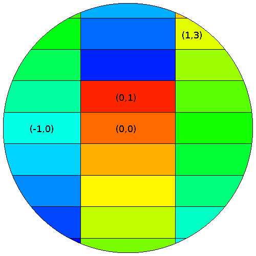
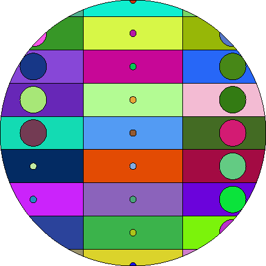

Getting started
===============

Installation
------------

.. |the pip package manager| replace:: the ``pip`` package manager
.. _the pip package manager: https://packaging.python.org/tutorials/installing-packages/

.. |the venv module| replace:: the ``venv`` module
.. _the venv module: https://docs.python.org/3/tutorial/venv.html

``t4_geom_convert`` is available on `PyPI
<https://pypi.org/project/t4-geom-convert/>`_. The suggested way to install it
is to use |the pip package manager|_, possibly in a virtual environment so that
you don't need root privileges (see |the venv module|_).  If ``pip`` and
``venv`` are not available on your machine, you can use your package manager to
install them:

.. code-block::

   $ sudo apt install python3-pip python3-venv  # on Debian/Ubuntu
   $ sudo yum install python3-pip python3-libs  # on CentOS 7

You can then create a virtual Python environment and install the latest stable
version of ``t4_geom_convert`` there with

.. code-block::

   $ python3 -m venv /path/to/some/folder
   $ source /path/to/some/folder/bin/activate
   $ pip install -U pip setuptools
   $ pip install t4_geom_convert

This will install the ``t4_geom_convert`` executable in
``/path/to/some/folder/bin/t4_geom_convert``. Sourcing
``/path/to/some/folder/bin/activate`` will put ``t4_geom_convert`` in your
``PATH``.

You can also install the latest development version with

.. code-block::

   $ pip install git+https://github.com/arekfu/t4_geom_convert.git@next

Dependencies
^^^^^^^^^^^^

``t4_geom_convert`` requires Python 3.6.

The MCNP input file is parsed by `MIP <https://github.com/travleev/mip>`_. We
use a slightly modified version of MIP, which is shipped along with
``t4_geom_convert``. MIP depends on `TatSu
<https://tatsu.readthedocs.io/en/stable/>`_.

``t4_geom_convert`` also depends on `NumPy <https://numpy.org/>`_.

Usage
-----

The basic usage is simply

.. code-block::

   $ t4_geom_convert <mcnp_input>

This will create a TRIPOLI-4 output file called ``<mcnp_input>.t4`` containing
the converted geometry.  You can also choose a different name for the output
file using the ``-o`` option.

Use the ``-h`` option for a list of all available options.

Lattice conversion
^^^^^^^^^^^^^^^^^^

``t4_geom_convert`` is capable of handling the conversion of repeated structures
(lattices). Hexahedral (``LAT=1``) and hexagonal (``LAT=2``) lattices are
supported.

The cell declared as ``LAT=1`` or ``LAT=2`` represents the unit cell of the
lattice, which is assumed to repeat in all directions up to the boundaries of
the enclosing cell. Due to limitations of the TRIPOLI-4 representation of
lattices, we have chosen to represent lattices using a purely surface-based
approach.  This means that ``t4_geom_convert`` will actually emit separate cell
definitions for each cell of the lattice that is visible through the enclosing
cell. The ranges of cell definitions to be emitted must be specified by the
user via the ``--lattice`` command-line option. For instance, consider the
following MCNP input:

.. code-block::

   A lattice example
   1 0  -2 1 -4 3 IMP:N=1 U=2 LAT=1
   10 1 -1. -10 IMP:N=1 FILL=2
   1000 0 10 IMP:N=0

   1 PX -1.5
   2 PX 1.5
   3 PY -0.5
   4 PY 0.5
   10 SO 4

   m1 13027 1.

Here the unit cell is two-dimensional. The lattice fills a sphere of radius 4.
Assuming the unit cell is indexed as `(0,0)`, the visible lattice cells are

* `(-1, -4)` to `(-1, 4)`
* `(0, -4)` to `(0, 4)`
* `(1, -4)` to `(1, 4)`

This can be confirmed by visual inspection of the MCNP geometry or by
geometrical considerations. Once the index bounds are determined, the
``--lattice`` option must be specified as

.. code-block::

   $ t4_geom_convert --lattice 1,-1:1,-4:4 <mcnp_input>
                               ↑  ↑ ↑  ↑ ↑
                cell number ───┘  │ │  │ └ j-range upper bound
           i-range lower bound ───┘ │  └─── j-range lower bound
             i-range upper bound ───┘

This results in the following TRIPOLI-4 geometry (X-Y cut), where a few cell
indices have been annotated:

         with their indices.
   :align: center

   Example of converted geometry with lattices.

The syntax for one-dimensional lattices is

.. code-block::

   --lattice <cell>,<i-from>:<i-to>

and for three-dimensional lattices it is

.. code-block::

   --lattice <cell>,<i-from>:<i-to>,<j-from>:<j-to>,<k-from>:<k-to>

Note that the ``ijk`` axes are not necessarily the same as the coordinate axes.
The orientation of the lattice axes is specified by MCNP (see the *Lattice
indexing* paragraph in the User's Manual) and it is determined by the order in
which the surfaces of the unit cell appear specified. In our example, the first
surface appearing in the definition of the unit cell is surface ``2``; therefore,
surface ``2`` separates the base cell `(0, 0)` from cell `(1, 0)`; the next
surface `(``1``) separates the base cell from cell `(-1, 0)`; the following
surfaces, ``4`` and ``3``, separate the base cell from cells `(0, 1)` and `(0,
-1)`, respectively.

For hexagonal lattices, ``t4_geom_convert`` follows the convention described in
the MCNP manual. The lattice axes are defined by the first and the third plane
appearing in the definition of the base cell. The positive direction of the
third axis (if present) is defined by the normal to the seventh plane appearing
in the definition.

A lattice unit cell may appear as a fill pattern in several enclosing cells. It
is currently not possible to specify different fill ranges for each of them.

Fully-specified lattices
^^^^^^^^^^^^^^^^^^^^^^^^

MCNP provides a syntax for the specification of lattice with heterogeneous
cells. An example is

.. code-block::

   A lattice example
   c cells
   2 0  -21 u=2 imp:n=1
   21 0  21 u=2 imp:n=1
   3 0  -31 u=3 imp:n=1
   31 0  31 u=3 imp:n=1
   10 0  -2 1 3 -4  lat=1 u=20 IMP:N=1
           FILL=-1:1 -4:4
   c       i=-1   i=0   i=1
           2      3     2   $ j=-4
           2      3     2   $ j=-3
           2      3     2   $ j=-2
           2      3     2   $ j=-1
           2      3     2   $ j=0
           3      3     2   $ j=1
           3      3     2   $ j=2
           3      3     2   $ j=3
           3      3     2   $ j=4
   100 1 -1. -10 IMP:N=1 FILL=20
   1000 0 10 IMP:N=0

   1 PX -1.5
   2 PX 1.5
   3 PY -0.5
   4 PY 0.5
   10 SO 4
   21 SO 0.4
   31 SO 0.1

   m1 13027 1.

The ``FILL=-1:1 -4:4`` option indicates the range of indices where cells will be
specified. The universes filling the cells are detailed in the table below,
which by convention loops over the leftmost (``i``) axis first. This syntax is
supported by ``t4_geom_convert`` and does *not* require a ``--lattice`` option.
One restriction applies: none of the subcells may be filled with the universe
of the lattice cell itself. This syntax indicates to MCNP that the cell should
be filled with the material of the lattice cell. Using ``0`` as a universe
number for the subcells is supported and results in no subcell being generated.

Here is how the example above is converted and rendered in TRIPOLI-4:

         rectangular and contain circles of different sizes.
   :align: center

   Example of converted geometry with fully-specified lattice.

Current limitations
-------------------

Here is a list of some things that ``t4_geom_convert`` cannot currently do, but
may be able to do in the future (in roughly decreasing order of likelihood):

* Import the title of the MCNP input file (tracked in `issue
  #5 <https://github.com/arekfu/t4_geom_convert/issues/5>`_)
* Handle affine transformations with ``m=-1`` (the last parameter of the
  affine transformation) (tracked in `issue
  #12 <https://github.com/arekfu/t4_geom_convert/issues/12>`_)
* Optimize fills with negative universes (do not intersect with the
  enclosing cell) (tracked in `issue
  #13 <https://github.com/arekfu/t4_geom_convert/issues/13>`_)
* Warn about isotopes that are missing from the TRIPOLI-4 dictionary
  (currently you need to edit the converted file by hand and remove the
  occurrences of the missing isotopes)
* Convert cell temperatures
* Import comments describing the MCNP cells/surfaces (tracked in `issue
  #9 <https://github.com/arekfu/t4_geom_convert/issues/9>`_)
* Provide a way to specify lattice fill ranges per enclosing cell(s) (this
  needs to be specified in such a way that it works with nested lattices, too)
* Deduplicate repeated cell definitions (this is a bit harder than
  deduplicating surfaces)
* Produce a TRIPOLI-4 connectivity map for as many cells as possible
  (mostly lattices)
* Recognize and automatically suppress empty cells (they may be generated
  by lattice development or fill development)

  * Use a linear programming solver for cells bounded by planes?
  * Use a SAT solver in the general case?

* Use ``PARALLELEPIPED`` and ``RESC`` to represent rotated lattices in the T4
  output. This will likely be *much* faster than representing all the cells
  individually.
* Convert (some) MCNP source definitions
* Convert (some) MCNP tally definitions

Your help is welcome! Feel free to open an issue if you would like to implement
a new feature or contribute to the project in any way.

The full changelog is :doc:`here <changelog>`.

Testing
-------

The correctness of ``t4_geom_convert`` is tested using `a specific test
oracle <mcnp-tripoli-4-comparison-oracle>`_, which is included in the `source
repository <https://github.com/arekfu/t4_geom_convert>`_.

Reporting bugs
--------------

Please report any bug/feature request on `the GitHub issues page
<https://github.com/arekfu/t4_geom_convert/issues>`_.

Licence and acknowledgments
---------------------------

The development of ``t4_geom_convert`` was partially financed by the
`EUROfusion <https://www.euro-fusion.org/>`_ consortium. ``t4_geom_convert`` is
released under the terms of the  `GNU General Public Licence, version 3
<https://www.gnu.org/licenses/gpl-3.0.en.html>`_.
