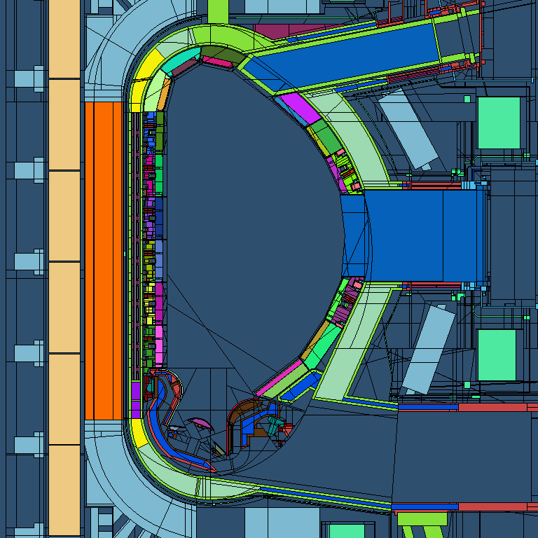

Welcome to the ``t4_geom_convert`` documentation!
=================================================

   A cut of the C-lite model of the ITER fusion reactor. The MCNP geometry was
   converted to the TRIPOLI-4 format by ``t4_geom_convert``. The plot was made
   with `T4G
   <https://www.cea.fr/energies/tripoli-4/Pages/PrePostTools/t4g.aspx>`_.

This is the documentation of ``t4_geom_convert``, a tool that converts `MCNP
<https://mcnp.lanl.gov/>`_ geometries into the `TRIPOLI-4®
<https://www.cea.fr/energies/tripoli-4>`_ format.

Features
--------

Here is a list of features of the MCNP modelling engine that are
at least partially supported and converted by ``t4_geom_convert``:

* All surface types
* Boolean cell operators
* ``LIKE n BUT`` syntax
* Affine transformations on surfaces and on cells
* Boundary conditions (reflection, white surfaces)
* Isotopic compositions and cell densities
* Universes and fills, even nested, possibly with affine transformations
* Lattices

.. toctree::
   :maxdepth: 2
   :caption: Contents:

   getting_started
   oracle/README
   modules/t4_geom_convert
   changelog

Indices and tables
==================

* :ref:`genindex`
* :ref:`modindex`
* :ref:`search`
